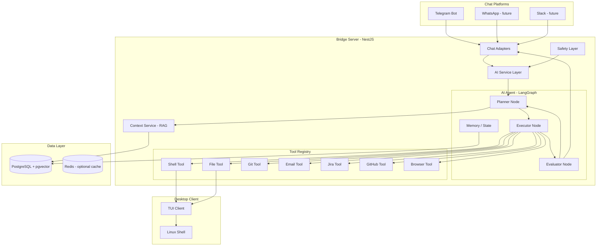

# 🚀 Orbit AI Integration Roadmap

> **From "run pwd" → "which directory am I in?" → "fix the Jira ticket and push it"**

## 1. Where You Are Now (MVP ✅)

```
User (Telegram) → "pwd" → Bridge Server → Desktop TUI → Shell → "/home/user" → Telegram
```

You have a working **command passthrough** pipeline. The user types exact shell commands, and the system executes them on a connected desktop and returns results. This is the foundation everything below builds on.

---

## 2. The Vision

```
User: "go to my project called test in Projects, open it in VS Code"

AI Agent:
  1. Thinks: "I need to find a directory called 'test' in ~/Projects"
  2. Runs: find ~/Projects -maxdepth 2 -type d -name "test"
  3. Gets:  /home/user/Projects/test
  4. Runs: cd /home/user/Projects/test && code .
  5. Replies: "✅ Opened /home/user/Projects/test in VS Code"
```

The AI sits **between the user's natural language and the shell**, translating intent into commands, executing them step-by-step, and reporting back in human-readable language.

---

## 3. Technology Choices — What You Actually Need

### 🧠 Quick Glossary (since you're new to AI)

| Term | What It Is | Do You Need It? |
|------|-----------|-----------------|
| **LLM** | Large Language Model (GPT-4, Claude, Gemini) — the "brain" that understands natural language | ✅ **Yes — this is your core** |
| **Agent** | An LLM that can use tools, make decisions, and loop until a task is done | ✅ **Yes — Phase 2+** |
| **Tool** | A function the agent can call (e.g., "run shell command", "read file", "send email") | ✅ **Yes — you already have one: shell execution** |
| **LangChain** | A JS/Python framework for building LLM-powered apps with chains and tools | ⚠️ **Optional** — useful but adds complexity |
| **LangGraph** | Extension of LangChain for building stateful, multi-step agent workflows with graphs | ✅ **Recommended for Phase 3+** — best for complex task flows |
| **RAG** | Retrieval-Augmented Generation — feed relevant docs/context to the LLM before answering | ⚠️ **Phase 4** — needed when the agent needs to "know" things (your projects, email history, etc.) |
| **MCP** | Model Context Protocol — a standard for connecting LLMs to external tools/data sources | ⚠️ **Phase 4+** — nice standardization layer but not essential early on |
| **Vector DB** | Database that stores text as mathematical vectors for semantic search (used in RAG) | ⚠️ **Phase 4** — only when you need RAG |
| **Fine-tuning** | Training an LLM on your specific data | ❌ **Not needed** — prompt engineering + tools is enough |

### 🏗️ Recommended Stack

```
┌─────────────────────────────────────────────────────┐
│                    Orbit AI Stack                    │
├─────────────────────────────────────────────────────┤
│  LLM Provider     │ OpenAI GPT-4o / Claude 3.5      │
│  Agent Framework   │ LangGraph (TypeScript)          │
│  Tool Execution    │ Your existing Desktop TUI       │
│  Orchestration     │ NestJS (your bridge server)     │
│  Context/Memory    │ PostgreSQL (you already have)   │
│  RAG (later)       │ pgvector extension              │
│  MCP (later)       │ MCP SDK for tool standardization│
└─────────────────────────────────────────────────────┘
```

**Why LangGraph over plain LangChain?**
Your use cases ("go to Jira, find ticket, fix it, push, email client") are multi-step workflows where the agent needs to:

- Make decisions based on intermediate results
- Loop back if something fails
- Maintain state across steps

LangGraph models these as **state machines / directed graphs** — it's purpose-built for this.

---

## 4. Phased Implementation Plan

### Phase 1: Natural Language → Shell Command (2-3 weeks)

**Goal**: User says "which directory am I in?" → AI translates to `pwd` → executes → returns answer.

#### Architecture

```
User Message
     │
     ▼
┌──────────────┐     ┌───────────────┐     ┌──────────────┐
│   Telegram    │────▶│  AI Service   │────▶│   Desktop    │
│   Adapter     │     │  (LLM Call)   │     │   TUI        │
│               │◀────│               │◀────│              │
└──────────────┘     └───────────────┘     └──────────────┘
```

#### What to Build

1. **`AICommandService`** in `packages/bridge/src/application/ai/`
   - Takes natural language input
   - Calls LLM API with a system prompt like:

     ```
     You are a Linux command translator. Convert the user's request into
     one or more shell commands. Respond ONLY with a JSON object:
     {
       "commands": ["pwd"],
       "explanation": "Shows current working directory",
       "risk": "low"
     }
     ```

   - Returns structured command(s) ready for execution

2. **Modify `CommandOrchestratorService`**
   - Before executing, pass user message through `AICommandService`
   - If AI returns commands, execute them sequentially
   - If AI flags risk as "high", ask user for confirmation first

3. **Safety Layer**
   - Command whitelist/blacklist (no `rm -rf /`, no `sudo` without approval)
   - Risk classification (low/medium/high/critical)
   - User confirmation for destructive commands

#### Tech Needed

- **OpenAI SDK** (`openai` npm package) or **Anthropic SDK** (`@anthropic-ai/sdk`)
- That's it. No frameworks. Direct LLM API call with structured output.

#### Example Flow

```
User: "in which directory am I?"
AI Service: { commands: ["pwd"], explanation: "...", risk: "low" }
Orchestrator: executes "pwd" on desktop
Desktop: returns "/home/ayan/Projects"
AI Service: formats response → "📂 You're in /home/ayan/Projects"
Telegram: sends formatted response back
```

---

### Phase 2: Multi-Step Command Chains (3-4 weeks)

**Goal**: User says "open my test project in VS Code" → AI runs `find`, then `cd`, then `code .`

#### Architecture

```
User Message
     │
     ▼
┌──────────────────────────────────────────────────┐
│              AI Agent (LangGraph)                 │
│  ┌──────────┐  ┌──────────┐  ┌──────────┐       │
│  │  Plan     │─▶│ Execute  │─▶│ Evaluate │─┐    │
│  │  Step     │  │ Command  │  │ Result   │ │    │
│  └──────────┘  └──────────┘  └──────────┘ │    │
│       ▲                                    │    │
│       └────────────────────────────────────┘    │
│                    (loop)                        │
└──────────────────────────────────────────────────┘
     │
     ▼
  Desktop TUI
```

#### What to Build

1. **`AgentService`** — the brain using LangGraph

   ```
   State Graph:
   START → plan → execute → evaluate → (done? → respond) or (→ plan)
   ```

2. **Tool Definitions** (functions the agent can call):
   - `run_shell_command(command: string)` — executes on desktop
   - `read_file(path: string)` — reads file content
   - `write_file(path: string, content: string)` — writes file
   - `list_directory(path: string)` — lists directory contents

3. **Conversation Memory** — store in PostgreSQL
   - The agent remembers previous commands and their results within a session
   - "now go into the src folder" works because it remembers the previous `cd`

4. **Streaming Responses**
   - Agent sends progress updates in real-time:

     ```
     🔍 Looking for "test" project...
     📂 Found: /home/user/Projects/test
     🚀 Opening in VS Code...
     ✅ Done!
     ```

#### Tech Needed

- **`@langchain/langgraph`** (TypeScript) — for the agent loop
- **`@langchain/openai`** or **`@langchain/anthropic`** — LLM bindings
- **Session-scoped conversation memory** (PostgreSQL)

---

### Phase 3: External Service Integrations (4-6 weeks)

**Goal**: User says "check my Jira tickets" or "send an email" → agent connects to external services.

#### New Tools for the Agent

| Tool | What It Does | How to Build |
|------|-------------|--------------|
| **Email Tool** | Send/read emails via Gmail API or SMTP | Gmail API with OAuth2, or Nodemailer for SMTP |
| **GitHub Tool** | Check PRs, issues, create branches | `@octokit/rest` (GitHub API SDK) |
| **Jira Tool** | Read tickets, update status, assign | Jira REST API with API token |
| **Browser Tool** | Navigate websites, scrape content | Playwright (headless browser) |
| **VS Code Tool** | Open files, run extensions | `code` CLI commands via shell |
| **Git Tool** | Commit, push, pull, branch | `simple-git` npm package or shell commands |

#### Architecture with Tools

```
┌───────────────────────────────────────────────────────┐
│                   AI Agent (LangGraph)                  │
│                                                         │
│  Available Tools:                                       │
│  ┌─────────┐ ┌─────────┐ ┌──────┐ ┌──────┐ ┌───────┐ │
│  │  Shell   │ │  Email  │ │GitHub│ │ Jira │ │Browser│ │
│  │ Command  │ │  Tool   │ │ Tool │ │ Tool │ │ Tool  │ │
│  └─────────┘ └─────────┘ └──────┘ └──────┘ └───────┘ │
│                                                         │
│  The LLM decides WHICH tools to use based on the        │
│  user's request. You don't hardcode the flow.           │
└───────────────────────────────────────────────────────────┘
```

#### Example: "Check Jira tickets assigned to me"

```
Agent Plan:
  1. Tool: jira.getMyTickets() → returns [{key: "PROJ-123", summary: "Fix login bug"}]
  2. Tool: formatResponse() → "You have 1 ticket: PROJ-123 - Fix login bug"
  3. Send to user
```

#### Example: "Fix ticket PROJ-123 and push it"

```
Agent Plan:
  1. Tool: jira.getTicket("PROJ-123") → {summary: "Fix null pointer in auth.ts", description: "..."}
  2. Tool: shell("cd /home/user/Projects/myapp")
  3. Tool: shell("git checkout -b fix/PROJ-123")
  4. Tool: read_file("src/auth.ts") → file content
  5. Tool: LLM analyzes the bug and generates a fix
  6. Tool: write_file("src/auth.ts", fixedContent)
  7. Tool: shell("git add . && git commit -m 'fix: PROJ-123 null pointer in auth' && git push")
  8. Tool: jira.updateTicket("PROJ-123", {status: "Done"})
  9. Send summary to user
```

#### OAuth & Credentials Management

- Store encrypted API tokens per user in PostgreSQL
- Support OAuth2 for Gmail, GitHub
- API key-based auth for Jira, Slack

---

### Phase 4: RAG + Context Awareness (4-6 weeks)

**Goal**: The agent "knows" your projects, preferences, and history.

#### Why RAG?

Without RAG, the agent has no idea about:

- Your project structure
- Your file contents
- Your email contacts
- Your coding style

**RAG = feed relevant context to the LLM before it answers**

#### Implementation

```
┌────────────────────────────────────────────────────────────┐
│                    Context Pipeline                         │
│                                                             │
│  User files ──┐                                             │
│  Git history ─┤──▶ Chunking ──▶ Embedding ──▶ pgvector DB  │
│  Email data  ─┤                                             │
│  Jira tickets─┘                                             │
│                                                             │
│  On query:                                                  │
│  User message ──▶ Search pgvector ──▶ Top 5 chunks ──▶ LLM │
└────────────────────────────────────────────────────────────┘
```

#### What to Build

1. **Indexing Service** — scans user's projects and indexes them
   - File tree structure
   - Key file contents (package.json, README, etc.)
   - Git log and branch info

2. **pgvector Extension** — add vector search to your existing PostgreSQL
   - No new database needed
   - Store embeddings alongside your existing data

3. **Context Retrieval** — before every LLM call, search for relevant context
   - "Open my test project" → retrieves info about projects named "test"
   - "Email John about the PR" → retrieves John's email from contacts

#### Tech Needed

- **`pgvector`** PostgreSQL extension (works with Neon!)
- **OpenAI Embeddings API** (`text-embedding-3-small`)
- **Chunking library** — `langchain/text_splitter`

---

### Phase 5: MCP Integration & Ecosystem (Future)

**Goal**: Standardize tool connections so anyone can add new integrations easily.

#### What is MCP?

**Model Context Protocol** is like "USB for AI tools" — it's a standard way for LLMs to discover and use tools. Instead of hardcoding each integration, you expose them as MCP servers.

```
┌────────────────────────────────────────────────────────┐
│                Orbit MCP Architecture                    │
│                                                          │
│  ┌──────────────┐                                        │
│  │  AI Agent     │                                       │
│  │  (MCP Client) │──────┐                                │
│  └──────────────┘      │                                 │
│                         ▼                                │
│  ┌──────────────────────────────────────────────────┐    │
│  │              MCP Router                           │   │
│  │  ┌─────────┐ ┌──────┐ ┌──────┐ ┌─────────────┐  │   │
│  │  │ Shell   │ │GitHub│ │ Jira │ │ Email       │  │   │
│  │  │ MCP     │ │ MCP  │ │ MCP  │ │ MCP         │  │   │
│  │  │ Server  │ │Server│ │Server│ │ Server      │  │   │
│  │  └─────────┘ └──────┘ └──────┘ └─────────────┘  │   │
│  └──────────────────────────────────────────────────┘    │
└──────────────────────────────────────────────────────────┘
```

#### Benefits of MCP

- **Community tools**: Use pre-built MCP servers (GitHub, Slack, etc. already exist)
- **Plugin system**: Users can add their own integrations
- **Standardized**: Any LLM can discover and use the tools automatically

#### When to Adopt

- **Not now.** Build your tools directly first (Phase 2-3)
- **Phase 5**: Wrap your existing tools as MCP servers for standardization
- The MCP SDK (`@modelcontextprotocol/sdk`) makes this conversion straightforward

---

## 5. Detailed Architecture Diagram



---

## 6. Where Everything Lives in Your Codebase

```
packages/
├── bridge/src/
│   ├── application/
│   │   ├── ai/                          ← NEW
│   │   │   ├── ai.module.ts             ← NestJS module
│   │   │   ├── ai-command.service.ts    ← Phase 1: LLM command translation
│   │   │   ├── agent.service.ts         ← Phase 2: LangGraph agent
│   │   │   ├── tools/                   ← Phase 2-3: Agent tools
│   │   │   │   ├── shell.tool.ts
│   │   │   │   ├── file.tool.ts
│   │   │   │   ├── git.tool.ts
│   │   │   │   ├── email.tool.ts
│   │   │   │   ├── github.tool.ts
│   │   │   │   ├── jira.tool.ts
│   │   │   │   └── browser.tool.ts
│   │   │   ├── memory/                  ← Phase 2: Conversation memory
│   │   │   │   └── conversation-memory.service.ts
│   │   │   ├── context/                 ← Phase 4: RAG
│   │   │   │   ├── indexing.service.ts
│   │   │   │   └── retrieval.service.ts
│   │   │   └── safety/                  ← Phase 1: Safety checks
│   │   │       └── command-safety.service.ts
│   │   ├── adapters/                    ← Existing
│   │   ├── execution/                   ← Modify orchestrator
│   │   └── session/                     ← Existing
│   └── ...
├── common/src/
│   ├── ai/                              ← Already exists (interfaces)
│   │   ├── index.ts                     ← Expand with agent types
│   │   ├── tool.interface.ts            ← Tool contract
│   │   └── agent.interface.ts           ← Agent contract
│   └── ...
└── desktop/                             ← Existing TUI
```

---

## 7. Implementation Priority & Timeline

```
Phase 1 (Weeks 1-3):    NLP Command Translation ─────────────▶ "what dir am I in?" → pwd
Phase 2 (Weeks 4-7):    Multi-Step Agent ────────────────────▶ "open test project in VS Code"
Phase 3 (Weeks 8-13):   External Services ──────────────────▶ "email John", "check Jira"
Phase 4 (Weeks 14-19):  RAG & Context ─────────────────────▶ Agent knows your projects
Phase 5 (Weeks 20+):    MCP & Ecosystem ──────────────────▶ Plugin system, community tools
```

### Phase 1 Dependencies (npm packages to add)

```json
{
  "openai": "^4.x",              // or "@anthropic-ai/sdk": "^0.x"
  "zod": "^3.x"                  // For structured LLM output validation
}
```

### Phase 2 Dependencies

```json
{
  "@langchain/langgraph": "^0.x",
  "@langchain/openai": "^0.x",   // or "@langchain/anthropic"
  "@langchain/core": "^0.x"
}
```

### Phase 3 Dependencies

```json
{
  "@octokit/rest": "^20.x",      // GitHub API
  "nodemailer": "^6.x",          // Email sending
  "googleapis": "^130.x",        // Gmail API (OAuth2)
  "playwright": "^1.x"           // Browser automation
}
```

### Phase 4 Dependencies

```json
{
  "pgvector": "^0.x"             // PostgreSQL vector search
}
```

---

## 8. Key Design Decisions

### ❓ Should I use LangChain or call the LLM API directly?

| Scenario | Recommendation |
|----------|---------------|
| Phase 1 (simple translation) | **Direct API call** — LangChain would be overkill |
| Phase 2+ (multi-step agent) | **LangGraph** — you need state management, tool calling, loops |

Start simple (Phase 1 with direct API), then upgrade to LangGraph when you need agents.

### ❓ Do I need to create a separate "Agent" service?

**Yes.** The agent should be a separate NestJS module (`AIModule`) that the `CommandOrchestratorService` consults. The orchestrator remains the coordinator, but it delegates "what commands to run" to the AI agent.

### ❓ Where does the AI processing happen?

**In the Bridge Server**, not the Desktop TUI. The Bridge Server has network access to LLM APIs and external services. The Desktop TUI remains a dumb executor — it receives commands and returns results.

### ❓ How do I handle costs?

- Use **GPT-4o-mini** for simple translations (cheap, fast)
- Use **GPT-4o** or **Claude Sonnet** for complex multi-step reasoning
- Cache common translations (e.g., "which dir am I in?" → `pwd`)
- Set per-user rate limits

### ❓ What about security?

- **Never run unvalidated commands** — always classify risk first
- **Sandbox destructive operations** — require user confirmation for `rm`, `chmod`, `sudo`, etc.
- **Scope tool access** — users opt-in to each external service (GitHub, Jira, etc.)
- **Audit log** — log every command the AI generates and executes

---

## 9. Sample Code Sketches

### Phase 1: Simple AI Command Service

```typescript
// packages/bridge/src/application/ai/ai-command.service.ts
import { Injectable } from '@nestjs/common';
import OpenAI from 'openai';

interface AICommandResult {
  commands: string[];
  explanation: string;
  risk: 'low' | 'medium' | 'high' | 'critical';
  needsConfirmation: boolean;
}

@Injectable()
export class AICommandService {
  private openai: OpenAI;

  constructor() {
    this.openai = new OpenAI({ apiKey: process.env.OPENAI_API_KEY });
  }

  async translateToCommands(userMessage: string): Promise<AICommandResult> {
    const response = await this.openai.chat.completions.create({
      model: 'gpt-4o-mini',
      response_format: { type: 'json_object' },
      messages: [
        {
          role: 'system',
          content: `You are a Linux command translator. Convert natural language to shell commands.
          Respond in JSON: { "commands": [...], "explanation": "...", "risk": "low|medium|high|critical", "needsConfirmation": bool }
          Rules:
          - risk=critical for rm -rf, format, dd, etc.
          - risk=high for sudo, chmod, chown, etc.
          - needsConfirmation=true for medium+ risk
          - If the request is unclear, set commands to empty and explain in explanation`
        },
        { role: 'user', content: userMessage }
      ],
    });

    return JSON.parse(response.choices[0].message.content!);
  }
}
```

### Phase 2: LangGraph Agent (Conceptual)

```typescript
// packages/bridge/src/application/ai/agent.service.ts
import { StateGraph, END } from '@langchain/langgraph';

const agentGraph = new StateGraph({
  channels: {
    messages: { type: 'list' },
    toolResults: { type: 'list' },
    plan: { type: 'string' },
    status: { type: 'string' },
  }
})
  .addNode('plan', planNode)        // LLM plans next step
  .addNode('execute', executeNode)  // Runs tool (shell, API, etc.)
  .addNode('evaluate', evalNode)    // LLM evaluates result
  .addEdge('plan', 'execute')
  .addEdge('execute', 'evaluate')
  .addConditionalEdges('evaluate', (state) => {
    if (state.status === 'done') return END;
    return 'plan'; // loop back to plan next step
  });
```

---

## 10. Immediate Next Steps (What to Do This Week)

1. **[ ] Set up OpenAI API key** in `packages/bridge/.env`
2. **[ ] Install `openai` package** in `packages/bridge`
3. **[ ] Create `AIModule`** at `packages/bridge/src/application/ai/ai.module.ts`
4. **[ ] Build `AICommandService`** — simple NLP → shell command translator
5. **[ ] Build `CommandSafetyService`** — risk classification + command blocking
6. **[ ] Modify `CommandOrchestratorService`** — route user messages through AI first
7. **[ ] Test with Telegram** — "which directory am I in?" should work
8. **[ ] Add conversation memory** — store chat history per session in PostgreSQL

---

## 11. Success Metrics per Phase

| Phase | User Can Say | System Does |
|-------|-------------|-------------|
| **1** | "which directory am I in?" | Translates to `pwd`, executes, responds |
| **1** | "show me all TypeScript files" | Translates to `find . -name "*.ts"` |
| **2** | "open my test project in VS Code" | Finds project → cd → code . |
| **2** | "create a new React app called dashboard" | npx create-react-app dashboard |
| **3** | "email top 10 cars list to <xyz@gmail.com>" | Composes email → sends via Gmail |
| **3** | "check my GitHub PRs for project abc" | Fetches PRs → formats → responds |
| **3** | "go to Jira, find my tickets" | Queries Jira API → lists tickets |
| **4** | "fix ticket PROJ-123 and push" | Reads ticket → understands code → fixes → pushes |
| **5** | "install the Slack integration" | Discovers MCP server → connects → ready |

---

## 12. Risks & Mitigations

| Risk | Impact | Mitigation |
|------|--------|-----------|
| AI generates dangerous commands | Data loss, system damage | Safety layer with risk classification + confirmation prompts |
| LLM hallucinations (wrong commands) | Confusion, errors | Always show commands before executing (for Phase 1), auto-execute only for low-risk |
| API cost explosion | Expensive bills | Rate limiting, caching, use cheaper models for simple tasks |
| Context window limits | Agent can't handle long outputs | Summarize large outputs, truncate file contents |
| Security (API keys stored in DB) | Credential theft | Encrypt at rest, scope permissions, audit access |
| Multi-step failures | Agent gets stuck in loops | Max iteration limits, timeout per step, fallback to human |

---

> **TL;DR**: Start with Phase 1 (direct LLM API call for NLP→command), graduate to LangGraph agents in Phase 2, add external tools in Phase 3, add RAG for context in Phase 4, and standardize with MCP in Phase 5. You don't need everything at once — build incrementally on top of your working MVP.
